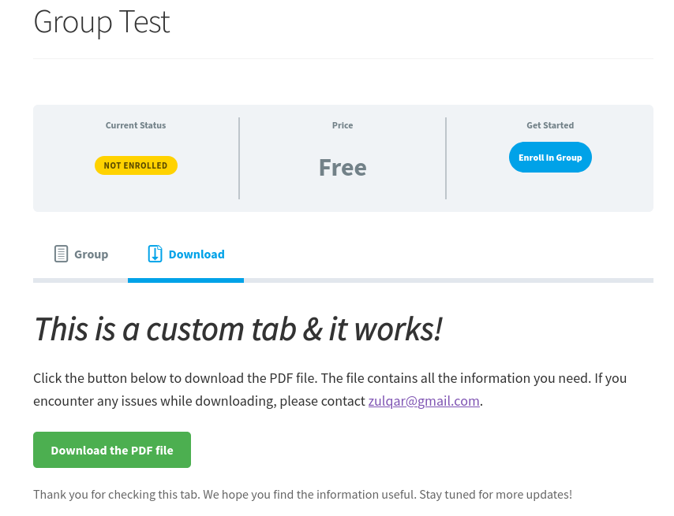

# LearnDash LMS - Add Custom Tabs

This plugin adds custom tabs to LearnDash for courses/lessons/topics/quizzes and groups.

## Description
**Important: This plugin requires PHP 7.4 or higher and LearnDash 4.2 or higher.**

This plugin is a powerful and versatile tool that seamlessly integrates with LearnDash, a popular learning management system.
It enhances the user experience by adding custom tabs to various sections of the platform, including courses, lessons, topics, quizzes, and groups.
These custom tabs provide a structured and organized view, making it easier for users to navigate and access the content they need.
Whether you're an educator looking to streamline your course layout, or a student seeking a more intuitive learning journey, this plugin is designed to cater to your needs.
It's a simple yet effective solution to optimize the LearnDash interface and elevate the e-learning experience.

## Installation
1. Ensure that your installation of WordPress is using PHP 7.2 or higher and LearnDash 3.6 or higher.
2. Upload the contents of the plugin zip file to the `/wp-content/plugins/` directory.
3. Activate the plugin through the Plugins menu in WordPress.

## Screenshots
1. Creating and Managing LMS Custom Tabs

</img>
2. Editing and Updating Custom Tabs

</img>
3. Custom Tab on Lesson Page

</img>
4. Custom Tab on Course Page

</img>
5. Custom Tab on Topic Page

</img>
6. Custom Tab on Quiz Page

</img>
7. Custom Tab on Group Page

</img>
